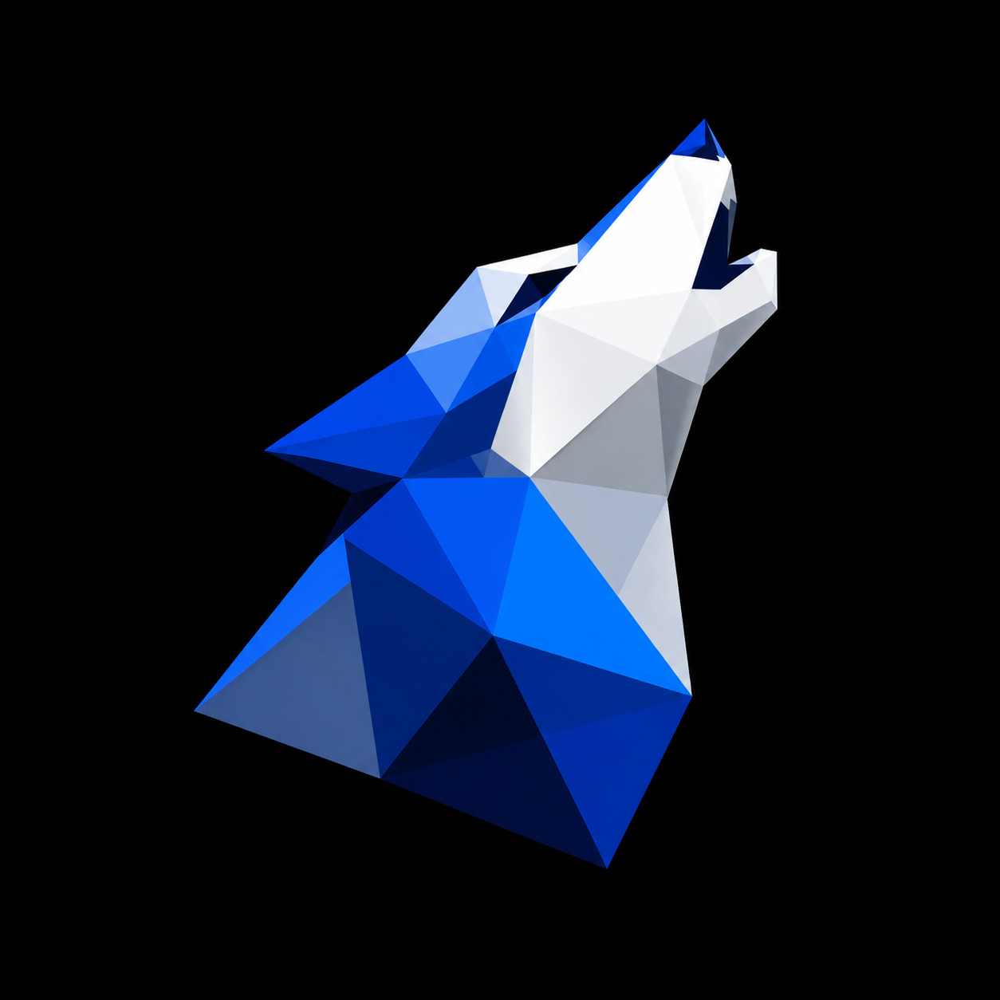

<!-- ====== HEADER / BANNER ====== -->

# VolKode

<!-- Texto animado -->

 

<!-- Contador de visitas (opcional, descomentar cuando quieras)

-->

---

## 🚀 Qué hacemos

En **VolKode** diseñamos **automatizaciones con IA** para resolver tareas repetitivas y procesos que hoy consumen tiempo y esfuerzo innecesario. Combinamos distintas herramientas para que tu negocio opere de forma más simple, rápida y escalable.

## 💡 Servicios

- 🤖 **Inteligencia Artificial** — agentes y soluciones a medida para tu operación.
- ⚙️ **Automatizaciones** — conectamos tus herramientas y eliminamos el trabajo manual repetitivo.
- 🌐 **Desarrollo Web** — sitios y aplicaciones rápidas, modernas y escalables.

## 🛠️ Stack tecnológico

## 🤝 Colaboradores

Equipo VolKode.

## 📬 Contacto

  
  
  
  <!-- WhatsApp / contacto: agregar cuando esté definido
  
  -->

## 📄 Licencia

Todos los derechos reservados © VolKode.

<!-- ====== FOOTER ====== -->

